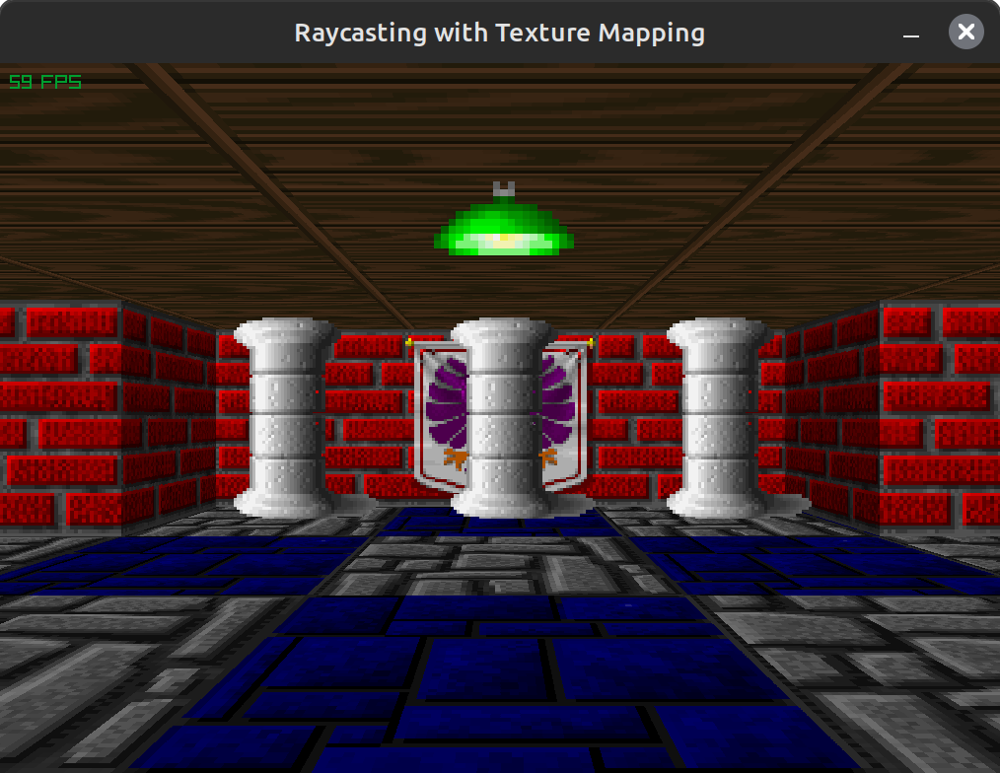
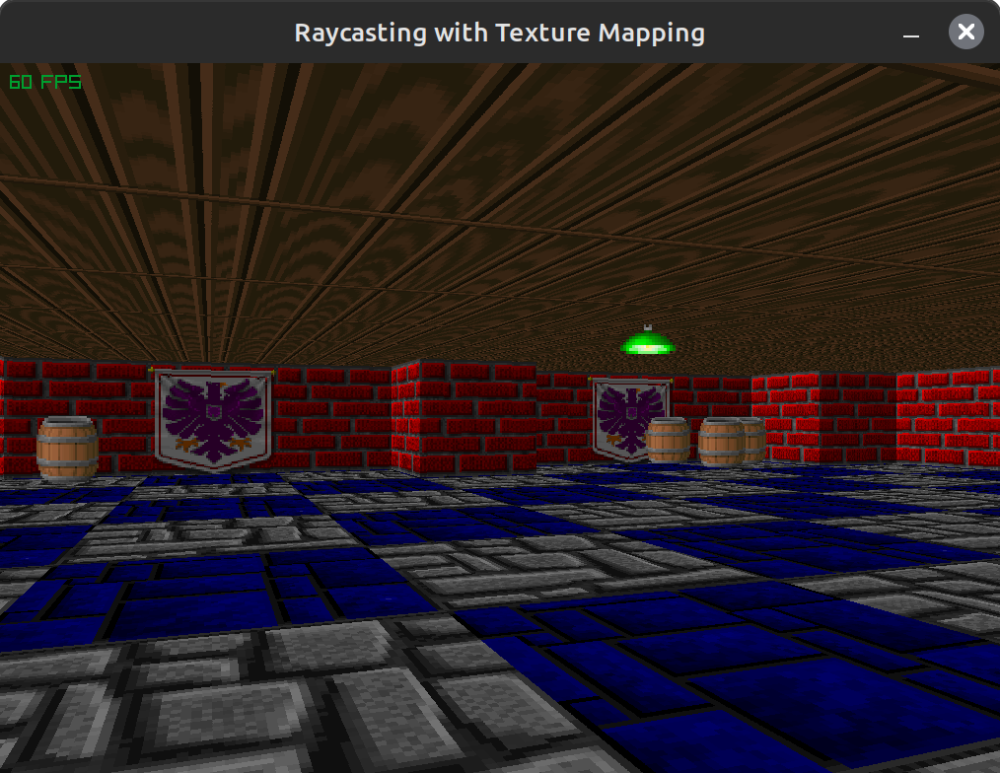
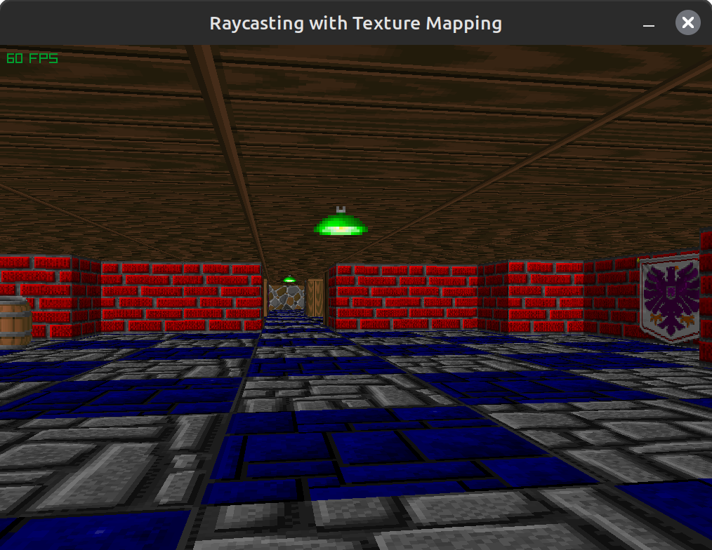

raycasting Demo with raylib

This project is a simple raycasting demonstration implemented using raylib, based on the tutorial available at Lode's Computer Graphics Tutorial. 
The demo renders a basic 3D environment with textured walls, floor, ceiling, and sprites.

Features

    Basic raycasting algorithm for rendering a 3D environment.
    Textured walls, floor, and ceiling rendering.
    Support for sprite rendering.

Controls

    Use the w/a/s/d keys to move forward, backward, and turn left or right.
    Press ESC to exit the demo.

# Some screenshots

    
